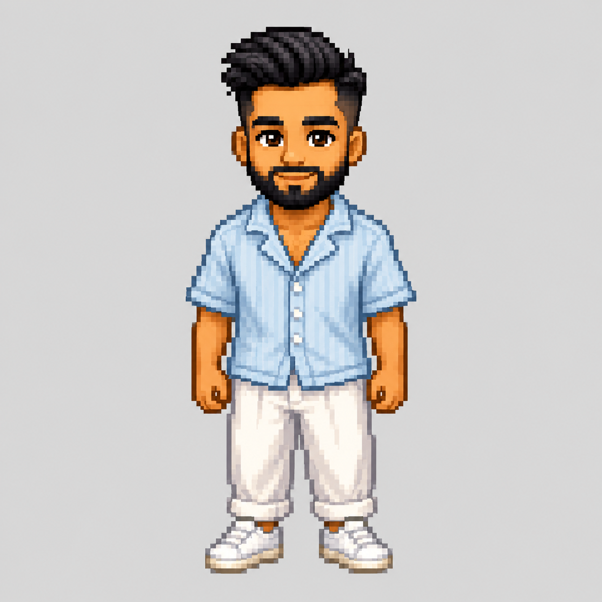
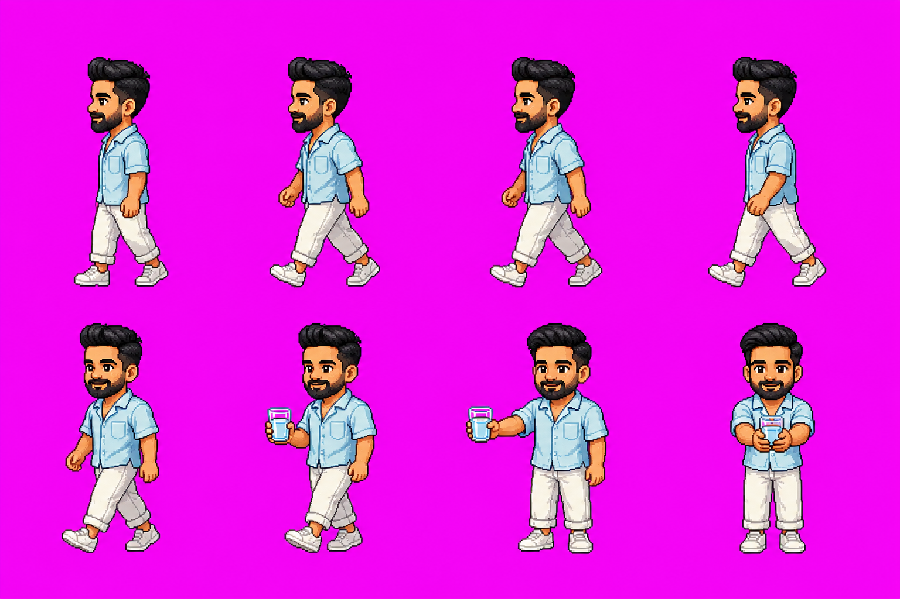
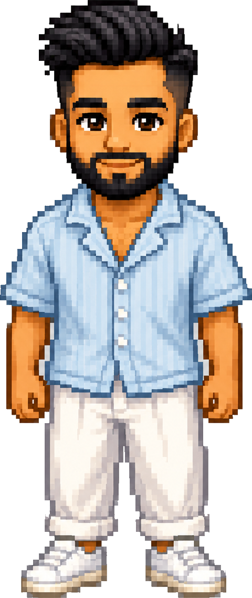
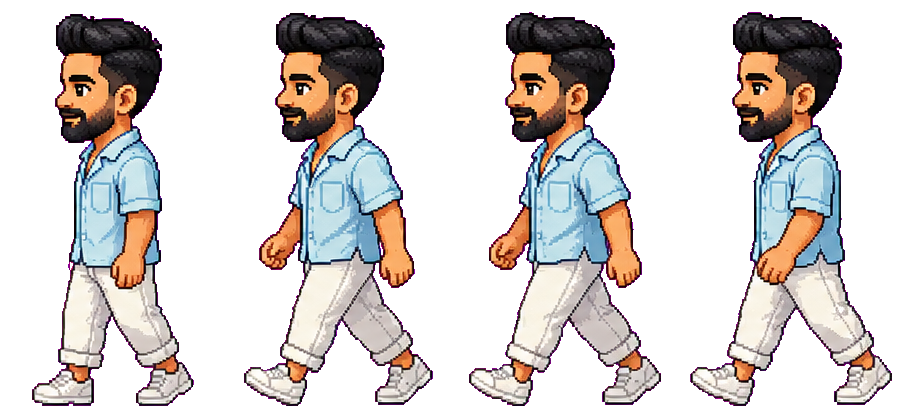
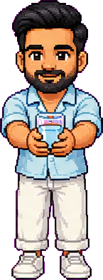

# Design Your Own Buddy 🎨

The buddy in Remi is just a handful of PNGs. Swap them and the app is *your*
character — you, your cat, a tiny robot, a dancing avocado. This guide walks the
whole pipeline: **generate art with an AI image model → key out the background →
slice it into frames → assemble a walk strip → build an app icon → wire it in.**

No art skills required. You need an AI image generator (ChatGPT / GPT-Image,
Gemini, or Midjourney), Python 3, and about 20 minutes.

---

## The pipeline at a glance

```
                    ┌───────────────────────────────────────────────┐
                    │  AI image model (GPT-Image / Gemini / MJ)      │
                    │  prompt: pixel-art poses on FLAT MAGENTA bg    │
                    └───────────────┬───────────────────────────────┘
                                    │  sprite sheet (poses on #FF00FF)
                                    ▼
          ┌── multi-pose sheet ─────────────────────┐   ┌── single pose ──────────┐
          │  tools/segment_sheet.py                 │   │  tools/cutout.py        │
          │    keys out magenta, finds blobs,       │   │    flood-fills the flat │
          │    saves each frame as r{row}_c{col}.png│   │    bg → transparent,    │
          └───────────────┬─────────────────────────┘   │    trims to content     │
                          │  transparent frames          └───────────┬─────────────┘
                          ▼                                           │
          ┌── tools/assemble_walk.py ───────────────┐                 ▼
          │    packs N frames into one equal-cell   │       buddy-hold.png  (arrival pose)
          │    horizontal strip, feet on a baseline │       buddy-idle.png  (front standing)
          └───────────────┬─────────────────────────┘
                          ▼
                    walk.png  (4-frame side walk strip)


   character PNG ──▶ tools/make_icon.py ──▶ icon_1024.png ──▶ .iconset ──▶ iconutil ──▶ build/icon.icns
```

Two branches, because sprites come in two shapes:

- **A multi-pose sheet** (many poses in a grid) → `segment_sheet.py` slices it into
  individual frames → `assemble_walk.py` lines up the walk frames into `walk.png`.
- **A single pose** (one character, one image) → `cutout.py` gives you a clean
  transparent PNG for the arrival pose or the icon source.

---

## Why flat magenta? (read this before you generate anything)

Every keying tool in this repo removes the background by **color**. The cleanest
color to key out is one that *never appears in your character*: pure magenta,
**`#FF00FF`** = `rgb(255, 0, 255)`. `segment_sheet.py` literally tests each pixel
for "high red, low green, high blue":

```python
is_bg = (r > 150) & (g < 120) & (b > 150)   # magenta ≈ (255, 0, 255)
```

Skin, hair, denim, water — none of those are magenta, so the mask is unambiguous.
Use white and it eats a white shirt; use green and it eats green eyes. Magenta is
the classic chroma-key color for exactly this reason.

Three more rules that make the pipeline *just work*:

| Rule | Why it matters |
|---|---|
| **Flat, solid magenta background** — no gradient, no texture, no vignette | The keyers match a narrow color range. A gradient bg leaves halos or holes. |
| **No drop shadows under the character** | A soft shadow is neither magenta nor character — it survives keying as gray schmutz around the feet. |
| **Consistent size & baseline across poses** | `assemble_walk.py` aligns feet to one baseline; wildly different scales make the walk cycle bob and jitter. Ask for "same scale, feet on the same line". |
| **Crisp pixel-art style, hard edges** | Anti-aliased fuzz between character and magenta becomes a colored fringe. High-clarity pixel art keys cleanest. |

If you take one thing from this doc: **flat `#FF00FF` background, no shadow,
same size every pose.**

---

## Step 1 — Generate the art

Remi's character is high-clarity **Stardew-Valley-style pixel art** generated from a
few selfies. You'll produce two things:

1. **A hero / reference pose** (front-facing full body) to lock the character design.
2. **A walk cycle** (4 side-view frames) + an **arrival pose** (front, holding a glass).

### Style references from this repo

These are the actual source images Remi shipped with — use them as style targets when
you prompt (attach them as reference images if your tool supports it).

**`assets/source-hero.png`** — the front-facing full-body reference that locked the
character design (light-gray bg, before magenta keying):



**`assets/source-sheet.png`** — a multi-pose sheet on flat magenta: a side-view walk
cycle (top row) plus front/idle and holding-glass variations. This is exactly the kind
of sheet `segment_sheet.py` slices:


**`assets/gpt-sheet.png`** — a tighter 8-pose sheet (GPT-Image output): 4 clean
side-walk frames on top, idle + holding-glass poses below, all on `#FF00FF`:



### Copy-paste prompts

Attach 2–4 clear selfies (or a photo of whatever your buddy is) as reference where the
tool allows it. Then use these — they're the seed prompts, refined for clean keying.

#### ChatGPT / GPT-Image

> Create a **high-clarity pixel-art** character based on the attached photo, in the
> style of a Stardew-Valley farmer portrait: crisp pixels, hard edges, clean cel
> shading, friendly proportions (slightly large head). **Full body, facing forward,
> standing relaxed, arms at sides.** Place it on a **flat, solid magenta background,
> exact color #FF00FF (255,0,255)** — no gradient, no texture, **no drop shadow** under
> the character. Center the character with a small margin. High resolution.

Then, in the same chat (keeps the character consistent):

> Now make a **sprite sheet of the same character on the same flat #FF00FF background**,
> arranged in a grid, **every pose at the same scale with the feet on the same
> horizontal line, no shadows**:
> - **Row 1:** a 4-frame **side-view walk cycle** facing left (contact, passing,
>   contact, passing) — legs and arms clearly in different positions each frame.
> - **Row 2:** front-facing **idle** standing; and a front-facing pose **holding a
>   glass of water in both hands** at chest height.
> Keep the outline crisp so the magenta keys out cleanly.

#### Google Gemini (Nano Banana / image mode)

> Using the attached photo as reference, generate a **Stardew-Valley-style pixel-art**
> version of this person: crisp pixels, clean shading, slightly oversized head,
> friendly. Output a **sprite sheet on a flat pure-magenta background (#FF00FF)** with
> **no shadows and no gradient**. Include a **4-frame left-facing walk cycle** (same
> scale, feet aligned on one baseline) and two front poses: **idle**, and **holding a
> glass of water**. Hard edges, no anti-aliased blur against the magenta.

#### Midjourney

> pixel art character of [describe subject], Stardew Valley farmer portrait style,
> crisp pixels, clean cel shading, slightly large head, full body,
> **4-frame side-view walk cycle sprite sheet + front idle + holding a glass of water**,
> all poses same size feet on one baseline, **flat solid magenta background #FF00FF, no
> shadow, no gradient**, high clarity --style raw --ar 3:2

> **Note:** models drift. You'll iterate — regenerate until the walk frames are clearly
> distinct poses at the same scale, the background is *evenly* magenta, and there's no
> shadow. It's normal to run a prompt 3–5 times. Pick the cleanest sheet; the Python
> tools handle the rest.

---

## Step 2 — Slice a multi-pose sheet → frames

`tools/segment_sheet.py` keys out the magenta, finds each character blob, groups them
into rows, and saves every pose as its own transparent PNG so you can inspect and pick.

**Install the deps once:**

```bash
python3 -m pip install -r tools/requirements.txt   # Pillow, numpy, scipy
```

**Run it:**

```bash
python3 tools/segment_sheet.py assets/gpt-sheet.png /tmp/frames
```

- **Input:** a sprite sheet on a flat magenta background.
- **Output:** `/tmp/frames/r{row}_c{col}.png` — one transparent PNG per detected pose,
  named by grid position (`r0_c0.png` is top-left). It prints each box's size and area
  so you can spot the walk frames vs. the idle/hold poses.

```
raw blobs: 9
row 0: 4 frames
  r0c0: box=(120,88,410,690) size=290x602 area=41210
  ...
row 1: 4 frames
  ...
```

Open the folder, eyeball the crops, and note which files are your 4 walk frames (in
order) and which is the "holding a glass" pose.

> **Tuning:** the script ignores blobs smaller than 1500 px (specks) and clusters rows
> by vertical center (within 250 px). If two poses merge into one blob or one splits in
> two, it's almost always a background that isn't *flat* magenta — regenerate the sheet
> cleaner rather than fighting the thresholds.

---

## Step 3 — Cut out a single pose → transparent PNG

For a one-off pose (the arrival "holding a glass" image, or a clean full-body for the
icon), `tools/cutout.py` flood-fills the flat background from the edges inward and trims
to the character. Because it floods **from the border**, background-colored pixels
*enclosed* by the character (gaps between arm and torso that the sheet slicer might
miss) are left alone unless they touch the edge.

```bash
python3 tools/cutout.py assets/source-hero.png assets/buddy-idle.png
# optional 3rd arg = color tolerance (default 45); raise it for a slightly noisy bg
python3 tools/cutout.py assets/source-hero.png assets/buddy-idle.png 60
```

- **Input:** a single-character image on a flat background (magenta *or* any solid
  color — it seeds from the average of the four corners).
- **Output:** a trimmed, transparent RGBA PNG. It prints the final size.

This is exactly how `assets/buddy-idle.png` was made from `assets/source-hero.png`:



---

## Step 4a — Assemble the walk strip

`tools/assemble_walk.py` takes your N transparent walk frames and packs them into a
single **equal-cell horizontal strip**, tight-cropping each frame and aligning feet to
a shared baseline so the cycle doesn't jitter.

```bash
python3 tools/assemble_walk.py src/renderer/walk.png \
  /tmp/frames/r0_c0.png /tmp/frames/r0_c1.png /tmp/frames/r0_c2.png /tmp/frames/r0_c3.png
```

- **Inputs:** the output path, then the frame PNGs **in walk order**.
- **Output:** `walk.png` — one row of equal-width cells (each frame centered
  horizontally, feet on the bottom baseline). It also writes a light-gray preview to
  `/tmp/walk-preview.png` so you can eyeball the cycle.

The shipped `src/renderer/walk.png` is **904×418 = four 226×418 cells**:



The arrival pose `src/renderer/buddy-hold.png` (front, holding the glass in both hands)
is just a `cutout.py` result of the corresponding sheet pose:



> **⚠️ The overlay expects exactly 4 walk frames.** The CSS animation is hard-coded to
> `steps(4)` (see Step 5). If you assemble a strip with a different frame count, update
> the CSS to match, or the cycle will tear. 4 frames is the sweet spot for a readable
> walk.

---

## Step 4b — Build the app icon

`tools/make_icon.py` composes a macOS-style app icon: a rounded-rect (squircle) blue
gradient with a drop shadow and top gloss, then your character's bust clipped inside it.

```bash
python3 tools/make_icon.py assets/buddy-idle.png /tmp/icon_1024.png
# optional args: CROP (top fraction of the character to keep, default 0.62)
#                FILL (character width as fraction of the inner box, default 0.92)
python3 tools/make_icon.py assets/buddy-idle.png /tmp/icon_1024.png 0.62 0.92
```

- **Input:** a transparent full-body character PNG (e.g. `buddy-idle.png`). It crops to
  the upper `CROP` fraction so the face + glass hand are big.
- **Output:** a **1024×1024** RGBA icon. The shipped result is `assets/icon.png`:


### 1024 PNG → `build/icon.icns`

macOS app bundles want a multi-resolution `.icns`. Build one with the system tool
`iconutil` (no install needed on macOS). Create an `.iconset` folder with the required
sizes, then convert:

```bash
mkdir -p /tmp/icon.iconset
sips -z 16 16     /tmp/icon_1024.png --out /tmp/icon.iconset/icon_16x16.png
sips -z 32 32     /tmp/icon_1024.png --out /tmp/icon.iconset/icon_16x16@2x.png
sips -z 32 32     /tmp/icon_1024.png --out /tmp/icon.iconset/icon_32x32.png
sips -z 64 64     /tmp/icon_1024.png --out /tmp/icon.iconset/icon_32x32@2x.png
sips -z 128 128   /tmp/icon_1024.png --out /tmp/icon.iconset/icon_128x128.png
sips -z 256 256   /tmp/icon_1024.png --out /tmp/icon.iconset/icon_128x128@2x.png
sips -z 256 256   /tmp/icon_1024.png --out /tmp/icon.iconset/icon_256x256.png
sips -z 512 512   /tmp/icon_1024.png --out /tmp/icon.iconset/icon_256x256@2x.png
sips -z 512 512   /tmp/icon_1024.png --out /tmp/icon.iconset/icon_512x512.png
cp                /tmp/icon_1024.png       /tmp/icon.iconset/icon_512x512@2x.png

iconutil -c icns /tmp/icon.iconset -o build/icon.icns
```

That's the `build/icon.icns` the `npm run package` script feeds to `electron-packager`
via `--icon=build/icon.icns`. (The intermediate `build/icon.iconset/` is git-ignored;
only the final `.icns` is committed.)

---

## Alternative — don't want to run Python? Let an AI stitch it for you 🤖

Steps 2–4 are just **mechanical image manipulation** — key out a background, find the
blobs, crop, align feet to one baseline, tile into a strip. A coding agent like
**Claude Code** or **Codex** is very good at exactly this: you hand it your generated
images plus the target spec, and it writes and runs the script for you. No Python
knowledge required — you just describe the destination. (This repo's own sprites were
produced this way; the `tools/*.py` scripts are the reference implementation the agent
can read and adapt.)

**The only thing the agent must get right is the output contract the app expects.**
Paste this into Claude Code / Codex from inside the repo, alongside your generated art:

> I have AI-generated character art in `./my-art/` (a multi-pose sheet and/or separate
> pose PNGs). Turn them into the two sprite files this Electron app loads, matching the
> existing ones exactly so I don't have to touch any CSS. Read `tools/*.py`,
> `src/renderer/index.html`, and `docs/DESIGN-YOUR-OWN-BUDDY.md` first to learn the
> contract, then:
>
> 1. **`src/renderer/walk.png`** — a horizontal walk strip: **4 equal-width cells**,
>    one walk-cycle frame per cell, **transparent background**, every frame
>    **bottom-center aligned so the feet sit on one baseline** (no vertical jitter as
>    the animation cycles). Current file is 904×418 (four 226×418 cells); match that
>    aspect so the CSS `background-size: 496px 230px` + `steps(4)` still lines up.
> 2. **`src/renderer/buddy-hold.png`** — a single transparent PNG of the character
>    holding a glass of water (the arrival/idle pose), tightly cropped to its alpha.
>
> Background of my source art is flat magenta `#FF00FF` (key it out to transparent).
> Use Pillow/numpy — mirror the approach in `tools/cutout.py`, `segment_sheet.py`, and
> `assemble_walk.py` rather than reinventing it. After writing the files, show me a
> side-by-side preview so I can eyeball the walk cycle and the feet baseline, then run
> `npm test` to confirm nothing broke.

Tips for a clean result:
- **Give the agent the frames in walk order.** If your sheet's poses are scrambled,
  tell it the sequence (e.g. "left-to-right is contact → passing → contact → passing").
- **Ask for the preview.** "Show me a preview strip on a light background" catches a
  misaligned baseline or an over-aggressive cutout before it ships.
- **Iterate in words, not pixels.** "Frame 3's feet float ~8px high, drop it to the
  baseline" is a perfectly good instruction — let the agent redo the math.
- **Icon too:** "now build a 1024×1024 macOS squircle icon from `buddy-hold.png` like
  `tools/make_icon.py`, then `iconutil` it into `build/icon.icns`" gets you the app icon.
- **Even the hero GIF:** ask it to render `src/renderer/index.html` headless
  (Playwright), drive the walk-in → offer sequence, and stitch the frames into
  `docs/media/remi-demo.gif` with `ffmpeg` — that's exactly how the README GIF was made.

Whichever route you take — Python scripts or an AI stitching them for you — you land on
the same two PNGs. Wire them in next.

---

## Step 5 — Wire it in

Drop your new PNGs into `src/renderer/`, overwriting the two the app loads:

| File | What it is | Loaded by |
|---|---|---|
| `src/renderer/walk.png` | 4-frame side-view walk strip | `renderer/index.html` CSS as `#walker` background |
| `src/renderer/buddy-hold.png` | front arrival pose (holding glass) | `renderer/index.html` `` |

### The sizing assumptions to match

The overlay animation lives in `src/renderer/index.html` (CSS) and is sequenced by
`src/renderer/overlay.js`. If your art has different proportions, adjust these:

**Walk strip (`#walker` in `index.html`):**

```css
#walker {
  width: 124px; height: 230px;          /* on-screen size of one frame  */
  background-image: url(walk.png);
  background-size: 496px 230px;          /* 4 cells × 124px — the strip, scaled to fit */
}
#walker.stepping { animation: step .55s steps(4) infinite; }
@keyframes step { from { background-position-x: 0; } to { background-position-x: -496px; } }
```

- The strip is scaled so **4 cells span `496px`** (`4 × 124px`); each `steps(4)` tick
  shifts one 124px cell. The source `walk.png` can be any size (Remi's is 904×418) —
  `background-size` rescales it. **What must hold: exactly 4 equal cells**, matching
  `steps(4)` and the `-496px` end position. Different frame count → change both.
- `#walker.flip { transform: scaleX(-1); }` mirrors the same strip for the walk-*out*,
  so you only need frames facing one direction.

**Arrival pose (`#avatar` in `index.html`):**

```css
#avatar { height: 217px; width: auto; }   /* buddy-hold.png, scaled by height */
```

Just swap `buddy-hold.png`; it's scaled by height, so any aspect ratio works. It bobs
with an idle animation, plays a `cheer` bounce on "Had it" and a `sad` shake on
"Snooze" — all CSS, no per-character tuning needed.

`overlay.js` doesn't hard-code any pixel sizes — it only toggles classes and timings
(`WALK_IN_MS`, `WALK_OUT_MS`, `AUTO_DISMISS_MS`). You shouldn't need to touch it unless
you want a faster/slower entrance.

### Swap the app icon

Replace `build/icon.icns` with your generated one (Step 4b), then rebuild:

```bash
npm run package        # bundles Remi.app with --icon=build/icon.icns
```

The menu-bar item itself is title-only (`💧 0/8 · 🔥5`) with no icon asset, so there's
nothing to swap there.

### Check it

```bash
npm test               # 34 tests — pure logic, unaffected by art (should stay green)
npm run demo           # buddy walks in ~2.5s after launch — watch your new character
```

`npm run demo` is the fast feedback loop: launch, buddy strolls in, verify the walk
cycle reads cleanly and the arrival pose looks right.

---

## Troubleshooting

| Symptom | Likely cause & fix |
|---|---|
| **Colored halo / fringe around the character** | The background wasn't *flat* magenta, or the art is anti-aliased against it. Regenerate on solid `#FF00FF`; for `cutout.py`, raise the tolerance arg (e.g. `... 60`). |
| **Gray schmutz around the feet** | A drop shadow survived keying. Re-prompt with "no shadow". |
| **`segment_sheet.py` finds too few / too many blobs** | Poses touch, or the bg has a gradient so magenta pixels between poses aren't keyed. Add spacing between poses and use a *flat* bg; regenerate rather than lowering the 1500-px speck threshold. |
| **Walk cycle jitters / bobs vertically** | Frames are different scales or feet aren't aligned. `assemble_walk.py` aligns feet, but garbage in = garbage out — ask the model for "same scale, feet on one baseline". |
| **Walk animation tears or skips** | Frame count ≠ 4 while CSS still says `steps(4)` / `-496px`. Match the CSS to your frame count (Step 5). |
| **Icon character is cropped weirdly** | Tune `make_icon.py`'s `CROP` (how much of the body to keep) and `FILL` (how wide) args. |
| **`ModuleNotFoundError: No module named 'scipy'`** | `python3 -m pip install -r tools/requirements.txt`. |
| **`iconutil: command not found`** | It's a macOS-only tool; run the icon build on a Mac. |
| **Character faces the wrong way walking out** | The walk-out reuses the same strip flipped via `#walker.flip`. Your frames should face **left** (the walk-in direction). |

---

That's the whole pipeline. Generate → key → slice → assemble → wire in. Have fun making
Remi look like whoever (or whatever) you want. 🎉
